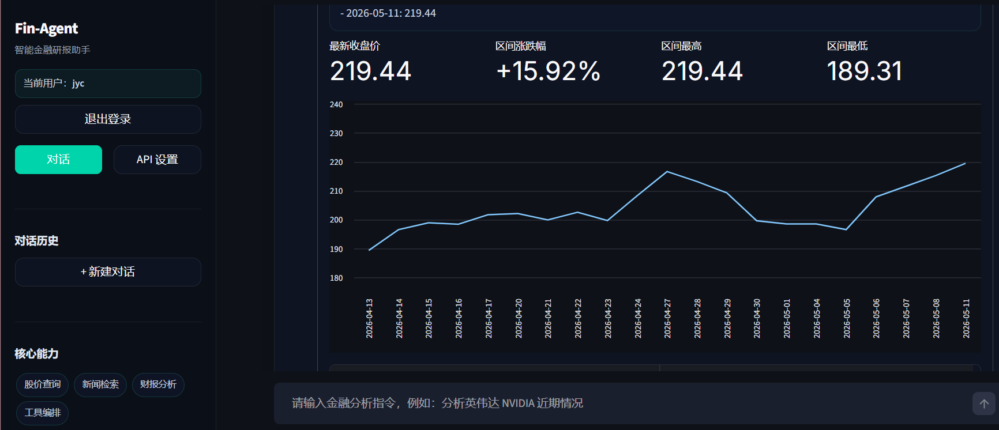

# Fin-Agent · 智能金融研报助手

基于 **LangGraph + LLM Tool Calling** 的金融研究 Agent：自然语言驱动股价查询、新闻检索与多源信息融合，输出结构化深度分析报告。前端 Streamlit，后端 MariaDB 持久化用户与历史会话。

> **在线演示**：<https://fin.momois.xyz/>

## 演示截图



---

## 功能特性

- **多工具 ReAct Agent**：股价查询（yfinance）、新闻检索（Tavily）、本地研报 RAG（FAISS），由 LLM 自主决策调用
- **用户系统**：注册 / 登录，bcrypt 密码哈希
- **Web 端 API 配置**：每个用户在 UI 中配置自己的 LLM 接口（OpenAI / 阿里云百炼 / Ollama / 自托管 vLLM 等 OpenAI 兼容协议）
- **多会话历史**：每个用户可新建多条对话，支持切换 / 重命名 / 删除，历史完整持久化
- **结构化报告**：Markdown 报告 + 关键指标卡片 + 股价折线图 + 工具调用步骤回放
- **一键 Docker 部署**：`docker compose up -d` 同时拉起 Web 应用 + 数据库

---

##  一键部署（推荐）

### 前置要求
- 已安装 Docker

### 步骤

```bash
# 1. 克隆仓库
git clone https://github.com/momo77990/fin-agent.git
cd fin-agent

# 2. 准备环境变量（数据库密码等。LLM/Tavily Key 后续在 Web UI 中填即可）
cp .env.example .env

# 3. 一键启动（首次会构建镜像 + 拉取 MariaDB，约 3-5 分钟）
docker compose up -d

# 4. 查看状态（两个服务都应是 healthy / running）
docker compose ps
```

打开浏览器访问：**<http://localhost:8501>**

首次进入会看到登录 / 注册页 —— 注册一个账号，然后在侧边栏「API 设置」里配置 LLM 接口即可开始使用。

### 常用命令

```bash
docker compose logs -f app          # 查看应用日志
docker compose restart app          # 仅重启应用（如改了代码）
docker compose down                 # 停止全部服务（保留数据）
docker compose down -v              # 停止并清空数据库与图表卷（谨慎！）
docker compose up -d --build app    # 重新构建应用镜像
```

---

## 配置 LLM API（在 Web UI 中完成）

启动应用并注册账号后，点击侧边栏的 **「API 设置」**，根据需要选择 provider 预设并填入：

- **Base URL**：OpenAI 兼容协议的 `/v1` 接口地址
- **Model**：模型名（例如 `deepseek-chat`、`qwen-plus`、`gpt-4o-mini`）
- **API Key**：你的密钥（每个账户独立保存）
- **Tavily API Key**（可选）：用于实时新闻检索

预置 provider 一键回填 base_url：

| 预设 | Base URL | 申请地址 |
|---|---|---|
| OpenAI | `https://api.openai.com/v1` | [platform.openai.com](https://platform.openai.com) |
| 阿里云百炼 (DashScope) | `https://dashscope.aliyuncs.com/compatible-mode/v1` | [dashscope.aliyun.com](https://dashscope.aliyun.com) |
| Ollama（本地） | `http://host.docker.internal:11434/v1` | [ollama.com](https://ollama.com) |
| 自定义 | 自填 | 任意兼容 OpenAI Chat Completions 协议的服务 |

> Tavily API Key 申请：[tavily.com](https://tavily.com)
>
> 配置只保存在你登录的账户下，其他用户不可见。

---

## 本地研报 / 财报 RAG

把任意 PDF（年报、招股书、券商研报…）放入项目根目录的 `data/` 文件夹：

```text
fin-agent/
└── data/
    ├── nvidia_2024_annual_report.pdf
    └── moutai_2023_q4.pdf
```

`docker-compose.yml` 已将 `./data` 挂载到容器内 `/app/data`，重启应用即可被 `search_filings` 工具检索（按文件 mtime 自动失效缓存，无需手动重建索引）。

> ⚠️ **关于嵌入模型**：`search_filings` 复用「API 设置」里填写的 LLM 凭据调用嵌入接口。DeepSeek 等纯对话 provider **不提供 embedding API**，需在「API 设置」里把 Embedding Model 字段切换到其他 provider 的模型名（例如 SiliconFlow 的 `BAAI/bge-large-zh-v1.5`、OpenAI 的 `text-embedding-3-small`、DashScope 的 `text-embedding-v4`），或保持 `data/` 为空以跳过 RAG。

---

##  本地开发模式（不使用 Docker）

适合调试代码：仅用 docker 起 DB，应用本机跑。

```bash
# 仅启动数据库容器
docker compose up -d mariadb

# 创建虚拟环境
python -m venv .venv
.venv\Scripts\activate          # Windows PowerShell
# source .venv/bin/activate     # macOS / Linux

# 安装依赖
pip install -r requirements.txt

# 运行
streamlit run app.py
```

⚠️ 此时 `.env` 中的 `DB_HOST` 保持 `localhost` 即可。

---

##  项目结构

```
fin-agent/
├── app.py                  # Streamlit 前端 + Agent 调度入口
├── agent_graph.py          # LangGraph StateGraph 定义
├── rag_engine.py           # FAISS 向量检索（PDF 财报）
├── tools/
│   ├── stock_tools.py      # yfinance 股价查询
│   ├── news_tools.py       # Tavily 新闻检索（含多级降级）
│   └── chart_tools.py      # Matplotlib 图表
├── db/
│   ├── models.py           # SQLAlchemy 模型 (User/Conversation/Message)
│   ├── session.py          # engine + SessionLocal
│   ├── auth.py             # 注册 / 登录（bcrypt）
│   └── chat_store.py       # 会话 / 消息 CRUD
├── Dockerfile              # 应用镜像
├── docker-compose.yml      # 应用 + MariaDB 编排
├── requirements.txt
└── .env.example
```

---

##  技术栈

| 层 | 技术 |
|---|---|
| LLM | Qwen-Plus / DeepSeek-V3 (via OpenAI 兼容协议) |
| Agent | LangGraph + LangChain |
| 后端 | Streamlit + SQLAlchemy 2.x |
| 数据库 | MariaDB 11 |
| 检索 | FAISS + OpenAIEmbeddings |
| 数据源 | yfinance · Tavily Search |
| 部署 | Docker · docker-compose |

---

## ⚠️ 已知约束

- 登录态保存在 Streamlit `session_state`（进程内内存）。浏览器刷新需重新登录；如需「记住我」可后续接入 `streamlit-cookies-manager`。
- 默认使用 `Base.metadata.create_all` 自动建表；schema 演化建议引入 Alembic。
- 端口冲突：默认占用 `8501`（应用）。可在 `.env` 中改 `APP_PORT`；MariaDB 不对外暴露端口，仅在 docker 网络内可见。

---

## 📄 License

MIT
